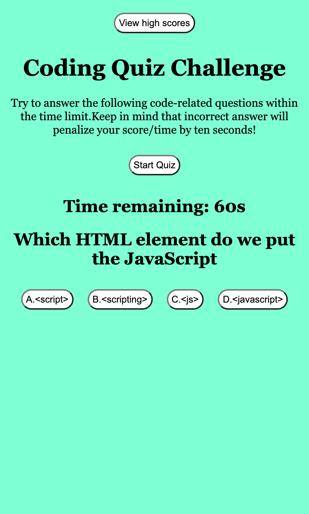
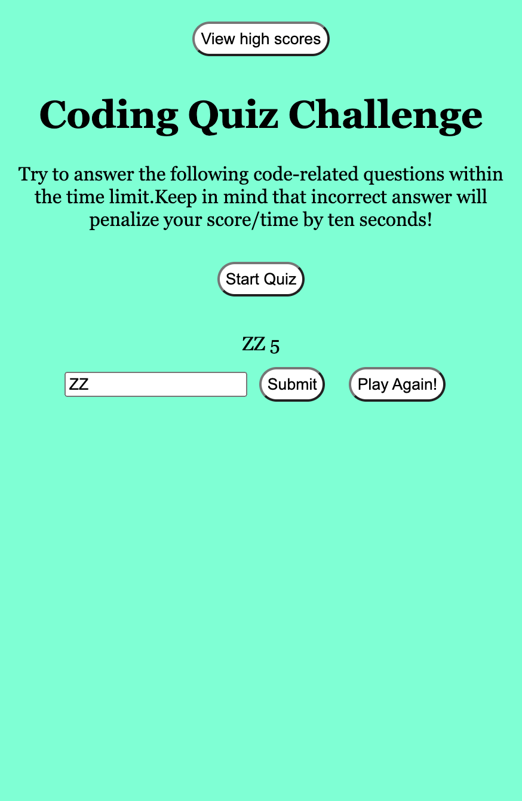

# Web APIs Challenge Code Quiz
Module 4 Challenge
## Description
This site is a timed coding quiz about JavaScript. User can take a timed quiz on JavaScript fundamentals that stores high scores. so that they can gauge their progress compared to their peers.
[Link](https://zhngzh527.github.io/Timed-quiz-JavaScript/)

I have using this technologies to create the web application:
- HTML
- CSS
- JavaScript (arrays, functions, methods)
- Web APIs (Create&append, Timers Intervals, Eventlistener, Local-storage)

## Application Screenshot

